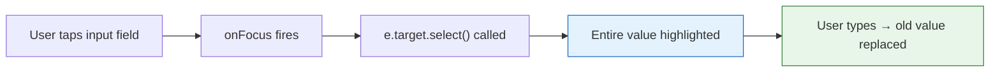

# Auto-Select Input Value on Focus

## Problem

When tapping/clicking on numeric input fields (e.g., batch quantity, material quantity overrides), the cursor simply positions itself in the input field without selecting the existing value. This forces the user to manually delete the old value before typing a new one — inefficient, especially on mobile where text selection is cumbersome.

**User request:** "When I tap or focus on the batch quantity input, I want the value inside to be highlighted, so it's easy for me to replace the value."

## Solution

Add an `onFocus` handler to each numeric input that calls `e.target.select()`. This is a native DOM method that selects all text in the input when it receives focus, so typing immediately replaces the old value.

### Implementation Pattern

```jsx
// Before
<input type="number" value={checked.batch_count} onChange={...} />

// After
<input type="number" value={checked.batch_count} onChange={...} onFocus={(e) => e.target.select()} />
```

The `onFocus={(e) => e.target.select()}` handler is a simple, zero-dependency solution that works on both desktop and mobile browsers.

## Affected File

Only [`src/ProductionPlanning.jsx`](../src/ProductionPlanning.jsx) — no other files need changes.

## Inputs to Modify

### 1. Batch Quantity Input (Line 615)

This is the primary input the user is asking about — the `batch_count` field in the product selection list.

```jsx
// Line 615 - add onFocus
<input 
  type="number" min="1" 
  className="form-control form-control-sm" 
  style={{ maxWidth: '100px' }} 
  value={checked.batch_count} 
  onChange={(e) => handleBatchChange(p.id, e.target.value)} 
  inputMode="numeric"
  onFocus={(e) => e.target.select()}  // ← ADD THIS
/>
```

### 2. Manual Quantity Override Input (Line 663)

The override quantity in the Shopping Summary section also has a numeric value that users may want to replace.

```jsx
// Line 663 - add onFocus
<input 
  type="number" min="0" step="0.01" 
  className={`form-control form-control-sm ${isManualQty ? 'border-warning' : ''}`} 
  style={{ maxWidth: '100px' }} 
  value={isManualQty ? manualQty[item.material_id] : ''} 
  onChange={(e) => updateManualQty(item.material_id, e.target.value)} 
  placeholder={display.qty} 
  inputMode="decimal"
  onFocus={(e) => e.target.select()}  // ← ADD THIS
/>
```

### 3. Edit Record Quantities Input (Line 802)

The edit quantities input in the Records tab detail view also benefits from auto-select.

```jsx
// Line 802 - add onFocus
<input 
  type="number" min="0" step="0.01" 
  className="form-control form-control-sm" 
  style={{ maxWidth: '100px' }} 
  value={editRecordQtys[item.id] || ''} 
  onChange={(e) => handleEditQtyChange(item.id, e.target.value)} 
  inputMode="decimal"
  onFocus={(e) => e.target.select()}  // ← ADD THIS
/>
```

## What's NOT Changing

- ✅ No business logic changes
- ✅ No CSS changes
- ✅ No new dependencies
- ✅ No other files modified
- ✅ No layout or styling changes

## Visual Flow



## Edge Cases

| Scenario | Behavior |
|----------|----------|
| Input is empty | `select()` on empty input is a no-op (nothing to select) |
| Input has placeholder only | Placeholder is not selectable text; no visible change |
| Rapid repeated taps | Each `focus` event triggers `select()` — safe, no side effects |
| Mobile keyboard | Works on mobile browsers — `select()` on numeric input selects the value |
| Disabled/readonly inputs | Not affected — disabled inputs don't receive focus events |
