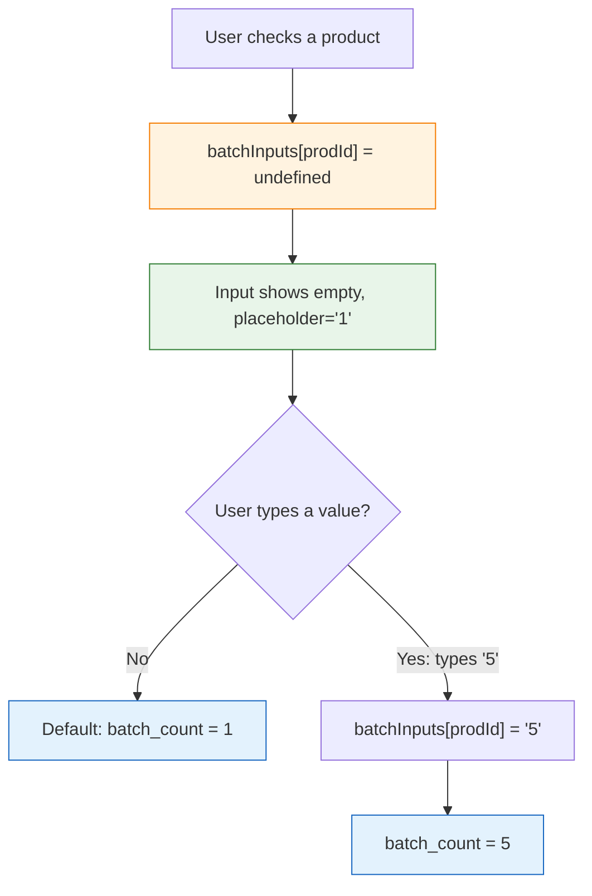

# Batch Input — Empty Field with Default Value 1

## Problem

The batch quantity input (line 615) currently shows `1` as a pre-filled value when a product is selected. To change it, the user must manually select/delete the `1` before typing. This is friction, especially on mobile.

**User request:** Follow the same pattern as the Shopping Summary override inputs — show an **empty input** with **"1" as placeholder**, and only use a value if the user explicitly types one. Internally default to `1` when saving.

## Solution

Introduce a new state `batchInputs` (mirroring the existing [`manualQty`](src/ProductionPlanning.jsx:119) pattern) to track user-entered batch values. The input appears empty with placeholder "1", and the default value of `1` is used only when the user hasn't typed anything.

## Changes

All changes in [`src/ProductionPlanning.jsx`](../src/ProductionPlanning.jsx).

### 1. Add new state (after line 114)

```jsx
// After: const [manualQty, setManualQty] = useState({})
const [batchInputs, setBatchInputs] = useState({})
```

### 2. Add handler (after line 119)

```jsx
// After: const updateManualQty = ...
const handleBatchInputChange = (prodId, value) => {
  setBatchInputs(prev => ({ ...prev, [prodId]: value }))
}
```

### 3. Modify the batch input (line 615)

**Before:**
```jsx
<input 
  type="number" min="1" 
  className="form-control form-control-sm" 
  style={{ maxWidth: '100px' }} 
  value={checked.batch_count} 
  onChange={(e) => handleBatchChange(p.id, e.target.value)} 
  inputMode="numeric" 
  onFocus={(e) => e.target.select()} 
/>
```

**After:**
```jsx
<input 
  type="number" min="1" 
  className="form-control form-control-sm" 
  style={{ maxWidth: '100px' }} 
  value={batchInputs[p.id] ?? ''} 
  placeholder="1"
  onChange={(e) => handleBatchInputChange(p.id, e.target.value)} 
  inputMode="numeric" 
/>
```

### 4. Update [`handleGenerateSummary`](src/ProductionPlanning.jsx:227) to use `batchInputs`

**Before (line 237):**
```jsx
batchDetails.push({ inventory_id: pp.inventory_id, batch_count: pp.batch_count })
```

**After:**
```jsx
const batchCount = parseInt(batchInputs[pp.inventory_id]) || 1
batchDetails.push({ inventory_id: pp.inventory_id, batch_count: batchCount })
```

And when calculating ingredient quantities (line 240):
```jsx
// Before
const totalQty = parseFloat(ing.quantity_used) * pp.batch_count

// After
const batchCount = parseInt(batchInputs[pp.inventory_id]) || 1
const totalQty = parseFloat(ing.quantity_used) * batchCount
```

### 5. Clear state on "Clear Selection" (line 624)

The existing `setPurchaseProducts([])` already clears products. Add `setBatchInputs({})` to also clear batch inputs.

Alternatively, since `batchInputs` is tied to product IDs that no longer exist, it's harmless but for cleanliness:

```jsx
// Line 624
<button onClick={() => { setPurchaseProducts([]); setBatchInputs({}) }} className="...">
```

### 6. (Optional) Revert the onFocus from previous change

Since the input is now empty, `onFocus={(e) => e.target.select()}` on the batch input is no longer needed (selecting an empty field is a no-op). We can remove it. The other two `onFocus` on lines 663 and 802 stay.

## Visual Flow



## What's NOT Changing

- ✅ The Shopping Summary manualQty inputs on line 663 stay as-is (already working)
- ✅ The edit record inputs on line 802 stay as-is
- ✅ The `onFocus` handlers on lines 663 and 802 remain
- ✅ Business logic, CSS, layouts — all unchanged
- ✅ No new dependencies

## Edge Cases

| Scenario | Behavior |
|----------|----------|
| User never touches batch input | Default `1` is used |
| User types and then clears the field | `batchInputs[prodId] = ''` → `parseInt('')` = NaN → defaults to `1` |
| User un-checks and re-checks a product | `batchInputs` still has old value unless cleared; Clear Selection clears it |
| User types non-numeric | `parseInt('abc')` = NaN → defaults to `1` |
