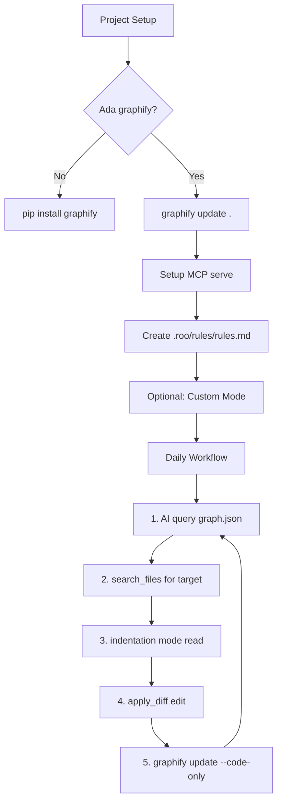

# Implementation Plan: Token-Saving Strategy

## Current State Analysis

| Item | Status |
|------|--------|
| Graphify-First Rule in [`.roo/rules/rules.md`](.roo/rules/rules.md) | ✅ Already exists |
| graphify MCP configured | ✅ Tapi **pointing ke project lain** (`/Users/azmanrazali/web/graphifyy/`) |
| graphify data for current project | ✅ Ada di [`graphify-out/`](graphify-out/) tapi **tak ada MCP serve** untuk project ni |
| Custom modes | ❌ Kosong |
| `rules/` subdirectory | ✅ Ada tapi empty selain `rules.md` |

---

## Untuk Projek NI (mywork)

### 1. Betulkan MCP Configuration

MCP [`graphify`](.roo/mcp.json) tengah point ke:
```
/Users/azmanrazali/web/graphifyy/graphify-out/graph.json
```

Tapi project ni guna:
```
/Users/azmanrazali/web/mywork/graphify-out/graph.json
```

**Perlu tukar** supaya MCP serve graph untuk project ni.

### 2. Upgrade Graphify-First Rule

Rule sedia ada di [`.roo/rules/rules.md`](.roo/rules/rules.md) dah ok, tapi boleh tambah:

```markdown
# Graphify-First Rule

Before making any code changes or reading source files in this project:

1. Check if `graphify-out/graph.json` exists
2. If yes, query it with Python `json` module to understand dependencies, affected files, and structure
3. Only read source files if the graph data is insufficient
4. If code may have changed since last graph build, run `graphify update . --code-only` first

# Token-Saving Reading Strategy

When you MUST read source files:

1. **search_files first** — cari exact pattern + line number
2. **read_file with indentation mode** — guna anchor_line dari search_results
3. **apply_diff for edits** — jangan write_to_file untuk existing files
4. **Batch all changes in one turn** — kurangkan turn count
```

### 3. Optional: Custom Mode untuk "Token-Saver"

Boleh define custom mode yang strict enforce strategi ni — tapi untuk sekarang rules update dah cukup.

---

## Untuk Projek LAIN (General)

Ada **3 layers** implementation — dari paling senang ke paling power.

### Layer 1: Rule File (Minimum — 2 minit setup)

Buat file `.roo/rules/rules.md` dalam mana-mana project:

```markdown
# Graphify-First Rule

Before reading or editing ANY source file:
1. Check `graphify-out/graph.json` exists
2. Query it to understand what to touch
3. Only read files the graph says are relevant
```

**Syarat:** Project kena ada `graphify-out/graph.json` (kena run `graphify update .` dulu).

### Layer 2: MCP + Graphify Serve (Recommended — 5 minit setup)

**Langkah 1: Install graphify**
```bash
pip install graphify
```

**Langkah 2: Build graph untuk project**
```bash
cd /path/to/project
graphify update .
```

**Langkah 3: Setup MCP**

Dalam [`mcp_settings.json`](.roo/mcp.json) global (atau project `.roo/mcp.json`):
```json
{
  "mcpServers": {
    "graphify": {
      "command": "python",
      "args": [
        "-m",
        "graphify.serve",
        "/absolute/path/to/project/graphify-out/graph.json"
      ]
    }
  }
}
```

**Langkah 4: Setup rules**

Buat `.roo/rules/rules.md` dengan Graphify-First Rule.

### Layer 3: Custom Mode + Rules (Maximum Power — 10 minit setup)

Buat custom mode dalam Antigravity IDE settings:

```yaml
# ~/Library/Application Support/Antigravity IDE/User/globalStorage/rooveterinaryinc.roo-cline/settings/custom_modes.yaml

customModes:
  - slug: token-saver
    name: "🪙 Token Saver"
    roleDefinition: |
      You are a token-efficiency expert. You NEVER read full files.
      You ALWAYS:
      1. Check graphify MCP first
      2. Use search_files to find exact lines
      3. Use read_file with indentation mode
      4. Use apply_diff for surgical edits
      5. Batch all changes in minimal turns
    groups:
      - read:
        - graphify-out/**
        - src/**/*.jsx
        - src/**/*.js
      - edit:
        - src/**/*.jsx
        - src/**/*.js
```

Kemudian rules file pointing ke custom mode ni.

---

## Dependency Graph Implementation



---

## Recommendation for YOU

Untuk projek ni ([`mywork`](.)):
1. **Segera:** Betulkan MCP path dari `graphifyy` → `mywork` ✅ (2 minit)
2. **Segera:** Upgrade [`rules.md`](.roo/rules/rules.md) dengan token-saving strategy (5 minit)
3. **Optional:** Buat custom mode `token-saver` untuk guna mode khusus

Untuk projeck lain:
- **Minimum:** Layer 1 (rule file je)
- **Recommended:** Layer 2 (MCP + rules) — sekali setup, jimat token selama-lamanya
- **Power user:** Layer 3 (custom mode) — kalau selalu guna AI untuk coding
