# Production Planning - Purchase Tab Redesign Plan

## Objective
Redesign the **Purchase tab** (lines 595-680) in [`ProductionPlanning.jsx`](../src/ProductionPlanning.jsx) so its visual styling **matches the Records tab** (lines 683-857) within the **same page**. No changes to any other files.

## Records Tab Design Patterns (Reference)

The Records tab uses these consistent visual patterns:

| Pattern | Implementation in Records Tab |
|---------|-------------------------------|
| **Card-based layout** | `.card.p-3.d-flex.flex-column.gap-0` for detail view (line 704) |
| **Section headers** | Inline style: `font-size: 11px; text-transform: uppercase; letter-spacing: 0.05em` + `text-muted` (lines 748, 764) |
| **Chip badges** | `chip-custom` with material icons (lines 729-736, 753, 830-837) |
| **Number circles** | `rounded-circle` with `width:32px height:32px background:var(--bg-input)` (line 778) |
| **Item rows** | `d-flex align-items-center gap-2 p-3` with `border-bottom` separators (line 776) |
| **Action buttons** | `btn btn-sm fw-bold` with icon + text, using `btn-success`, `btn-warning`, `btn-primary` (lines 690-700) |
| **Empty states** | `text-center py-5 text-muted` or `text-center py-4 text-muted fw-bold` (lines 766, 807) |
| **Cost display** | `font-mono small fw-bold text-nowrap` with `RM` prefix (line 793) |
| **Border separators** | `border-bottom border-default` (lines 706, 747, 776) |
| **Date block** | `flex-shrink-0 text-center rounded-3 px-2 py-1` with `var(--bg-input)` background (lines 708-717) |
| **Header area** | `page-header-custom` with `page-title-custom` and `page-subtitle-custom` (lines 417-421) |
| **Back button** | `btn btn-sm btn-link` with arrow (line 688) |

## Detailed Changes to Purchase Tab

### Change 1: Left Column - Product Selection Card Header
**Current (line 599):**
```jsx
<h6 className="fw-bold">Select Products & Set Batches</h6>
```
**Target:** Use Records tab section header style (11px uppercase letter-spacing):
```jsx
<div className="text-muted mb-3" style={{ fontSize: '11px', textTransform: 'uppercase', letterSpacing: '0.05em' }}>
  <span className="material-symbols-outlined me-1" style={{ fontSize: '14px', verticalAlign: 'middle' }}>inventory_2</span>
  Select Products & Set Batches
</div>
```

### Change 2: Product Checkbox Rows - Match Item Row Style
**Current (lines 601-611):**
```jsx
<div key={p.id} className="flex-wrap d-flex align-items-center gap-2 p-2 rounded-3">
```
**Target:** Match Records item row pattern (lines 776):
```jsx
<div key={p.id} className={`d-flex align-items-center gap-2 p-3 ${i < products.length - 1 ? 'border-bottom' : ''}`}>
```
Also add number circles like Records tab:
```jsx
<div className="flex-shrink-0 d-flex align-items-center justify-content-center rounded-circle" style={{ width: '32px', height: '32px', background: 'var(--bg-input)', fontSize: '13px' }}>{i + 1}</div>
```

### Change 3: Right Column - Shopping Summary Card Header
**Current (line 619):**
```jsx
<h6>Shopping Summary</h6>
```
**Target:** Use Records tab section header style:
```jsx
<div className="text-muted mb-3" style={{ fontSize: '11px', textTransform: 'uppercase', letterSpacing: '0.05em' }}>
  <span className="material-symbols-outlined me-1" style={{ fontSize: '14px', verticalAlign: 'middle' }}>shopping_cart</span>
  Shopping Summary
</div>
```

### Change 4: Batch Details Display - Use Chip Pattern
**Current (lines 622-624):**
```jsx
<div className="p-3 rounded-3 small">
  {purchaseSummary.batchDetails.map((b, i) => {
    const prod = products.find(p => p.id === b.inventory_id);
    return <div key={i}>• {prod?.product_name} — {b.batch_count} batch(es)</div>
  })}
</div>
```
**Target:** Use `chip-custom` like Records tab does for batches (lines 749-759):
```jsx
<div className="d-flex flex-wrap gap-2 mb-3">
  {purchaseSummary.batchDetails.map((b, i) => {
    const prod = products.find(p => p.id === b.inventory_id);
    return (
      <span key={i} className="chip-custom d-inline-flex align-items-center gap-1" style={{ fontSize: '12px', padding: '4px 10px' }}>
        <span className="fw-bold">{prod?.product_name || 'Unknown'}</span>
        <span className="text-muted">— {b.batch_count} batch</span>
      </span>
    )
  })}
</div>
```

### Change 5: Shopping Summary Table - Match Records Item Row Style
**Current (lines 628-636):** Uses `table table-sm` with `<td>` cells.

**Target:** Replace the table with Records-style item rows (matching lines 768-799) for a card-based layout instead of a table. Each material row becomes a `d-flex align-items-center gap-2 p-3` row with:
- Number circle (32px)
- Material name + qty info
- Cost on the right with `font-mono`

The desktop/mobile split stays (table hidden on mobile, card view visible on mobile), but **desktop now also uses card rows instead of a table** for consistency with Records.

### Change 6: TOTAL Display - Match Records Total Style
**Current (lines 669-671):**
```jsx
<div className="d-flex justify-content-between align-items-center pt-3">
  <span>TOTAL</span>
  <span>RM {...}</span>
</div>
```
**Target:** Match Records detail total style (lines 740-743):
```jsx
<div className="d-flex justify-content-between align-items-center py-3 border-top border-default">
  <div className="text-muted" style={{ fontSize: '10px', textTransform: 'uppercase', letterSpacing: '0.05em' }}>Total</div>
  <div style={{ fontSize: '20px', fontWeight: 700, lineHeight: 1.2 }}>RM {totalCost.toFixed(2)}</div>
</div>
```

### Change 7: Notes Field
**Current (line 673):**
```jsx
<div><label className="form-label">Notes (optional)</label><input type="text" className="form-control small" ... /></div>
```
**Target:** Keep similar but add border-top separation before it:
```jsx
<div className="pt-3 border-top border-default">
  <div className="text-muted mb-2" style={{ fontSize: '11px', textTransform: 'uppercase', letterSpacing: '0.05em' }}>Notes</div>
  <input type="text" className="form-control" placeholder="e.g., Purchase for weekend event" value={purchaseNotes} onChange={(e) => setPurchaseNotes(e.target.value)} />
</div>
```

### Change 8: Save Record Button - Match Records Button Style
**Current (line 674):**
```jsx
<button onClick={handleSavePurchase} disabled={loading} className="btn w-100 fw-bold text-white">
```
**Target:** Use Records tab button pattern (btn-primary with icon, matching line 699):
```jsx
<button onClick={handleSavePurchase} disabled={loading} className="btn btn-primary w-100 fw-bold text-white">
```

### Change 9: Generate Shopping List Button - Match Action Button Style
**Current (line 613):**
```jsx
<button onClick={handleGenerateSummary} disabled={purchaseProducts.length === 0 || loading} className="btn btn-primary w-100 fw-bold">
```
**Target:** Keep btn-primary but add proper spacing consistent with Records tab button patterns.

### Change 10: Clear Selection Button
**Current (line 614):**
```jsx
<button onClick={() => setPurchaseProducts([])} className="btn btn-sm btn-link w-100">Clear Selection</button>
```
**Target:** Use secondary button pattern:
```jsx
<button onClick={() => setPurchaseProducts([])} className="btn btn-sm btn-outline-secondary w-100">Clear Selection</button>
```

### Change 11: Empty States - Match Records Empty State
**Current (line 611):** `No products. Create in Inventory first.`
**Current (line 676):** `Select products and batches on the left, then click Generate.`
**Target:** Keep similar text but use Records tab consistent empty state styling:
```jsx
<div className="text-center py-4 text-muted fw-bold">No products available. Create in Inventory first.</div>
```

### Change 12: Right Column Card - Use gap-0 Like Records Detail Card
**Current (line 618):** `className="card p-3 d-flex flex-column gap-3"`
**Target:** `className="card p-3 d-flex flex-column gap-0"` and use `border-bottom border-default` between sections instead of gap spacing.

### Change 13: Product List Empty State
No change needed — already uses `text-center py-4 text-muted` which matches Records pattern.

## What's NOT Changing
- ✅ All business logic (Supabase queries, state management, calculations)
- ✅ No changes to Records tab
- ✅ No changes to other files (ReceiptManager, AdsRecordManager, etc.)
- ✅ No new dependencies
- ✅ Toast system stays as-is (inline showMsg pattern)
- ✅ Side sections (Materials, Recipes) stay unchanged
- ✅ Layout wrapper stays as-is

## Visual Summary

```mermaid
flowchart TD
    subgraph "Current Purchase Tab"
        PT["Two-column card layout"]
        T1["Table-based shopping summary"]
        T2["Plain h6 section headers"]
        T3["Simple text batch details"]
        T4["Plain TOTAL display"]
        T5["Standard btn-primary buttons"]
    end

    subgraph "Records Tab Design Patterns"
        RT["Card-based item rows"]
        R1["d-flex align-items-center gap-2 p-3 rows"]
        R2["11px uppercase letter-spacing headers"]
        R3["chip-custom badge style"]
        R4["font-size:20px weight:700 total"]
        R5["btn btn-sm fw-bold with icon"]
    end

    subgraph "Updated Purchase Tab"
        PT2["Card-based material rows"]
        T1_2["Item rows matching Records style"]
        T2_2["11px uppercase section headers"]
        T3_2["chip-custom batch badges"]
        T4_2["20px bold TOTAL display"]
        T5_2["Records-style action buttons"]
    end

    PT --> PT2
    T1 --> T1_2
    T2 --> T2_2
    T3 --> T3_2
    T4 --> T4_2
    T5 --> T5_2

    RT -. "design reference" .-> PT2
    R1 -. "design reference" .-> T1_2
    R2 -. "design reference" .-> T2_2
    R3 -. "design reference" .-> T3_2
    R4 -. "design reference" .-> T4_2
    R5 -. "design reference" .-> T5_2
```



## Implementation Steps (in order)

1. **Update Left Column card header** (h6 → 11px uppercase section header)
2. **Update product checkbox rows** (plain rows → Records-style item rows with number circles and border-bottom)
3. **Update Right Column card header** (h6 → 11px uppercase section header)
4. **Update batch details** (simple text → chip-custom badges)
5. **Replace shopping summary table** (table → Records-style card item rows; remove desktop/mobile split since both now use the same card layout)
6. **Update TOTAL display** (plain → Records-style large bold total)
7. **Update Notes field** (add border-top separation, use section header style)
8. **Update Save Record button** (add btn-primary class, consistent with Records)
9. **Update Clear Selection button** (btn-link → btn-outline-secondary)
10. **Update empty states** (use consistent text-muted fw-bold pattern)

## Risk Assessment
- **Low risk**: Visual-only changes to the Purchase tab
- **Easy to verify**: Just toggle between Purchase and Records tabs to compare styling
- **Easy to revert**: Only one file, changes are contained within lines 595-680
