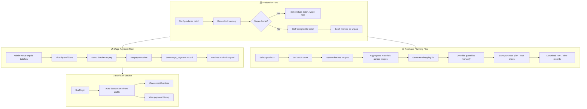

# Projek mywork (B.O.L. FOOD SERVICES) — Pemahaman Keseluruhan

## Ringkasan

**mywork** adalah sistem pengurusan operasi makanan (food services) yang dibina dengan React 19 + Vite 8 + Supabase + Bootstrap 5 (dark theme). Ia di-deploy ke Cloudflare Pages. Aplikasi ini menguruskan **produksi makanan**, **stok**, **resit belian**, **gaji staf**, dan **perancangan belian bahan**.

---

## Tech Stack

| Lapisan | Teknologi |
|---------|-----------|
| Framework | React 19 + Vite 8 |
| Backend/Database | Supabase (PostgreSQL + Auth + Edge Functions) |
| UI | Bootstrap 5 (dark theme custom) |
| Icons | Google Material Symbols |
| PDF | jsPDF + jsPDF-AutoTable (dependencies) |
| Deployment | Cloudflare Pages (wrangler.toml) |

---

## Seni Bina

### Authentication & Authorization

- **Login/Register** via Supabase Auth (email/password) — [`src/Login.jsx`](../src/Login.jsx)
- **3 roles**: `super_admin`, `admin`, `default` — [`src/App.jsx:71`](../src/App.jsx#L71)
- **Module permissions**: Setiap modul boleh di-toggle akses per-user via table `user_permissions` — [`src/App.jsx:75-77`](../src/App.jsx#L75)
- **Force password change**: Pengguna baru kena tukar password — [`src/App.jsx:74`](../src/App.jsx#L74)
- **Edge Functions**: Admin functions untuk create/delete user, change role, reset password — [`src/Privileges.jsx`](../src/Privileges.jsx#L76-L116)

### Layout

```
┌──────────────────────────────────────┐
│ Sidebar (240px, fixed) │ Topbar (sticky)    │
│ ┌────────────────┐    │ ┌─────────────────┐ │
│ │ B.O.L. LOGO    │    │ │ Menu │ Avatar    │ │
│ ├────────────────┤    │ ├─────────────────┤ │
│ │ Nav Items      │    │ │ Main Content    │ │
│ │  - Home        │    │ │ (Page Modules)  │ │
│ │  - Ads Records │    │ │                 │ │
│ │  - Inventory   │    │ │                 │ │
│ │  - Receipts    │    │ │                 │ │
│ │  - Wages       │    │ │                 │ │
│ │  - My Wage     │    │ │                 │ │
│ │  - Planning    │    │ │                 │ │
│ │  - Privileges  │    │ │                 │ │
│ │  - Settings    │    │ │                 │ │
│ ├────────────────┤    │ └─────────────────┘ │
│ │ Logout         │    │                     │
│ └────────────────┘    └─────────────────────┘
└──────────────────────────────────────┘
```

- Responsif: sidebar jadi mobile drawer — [`src/App.jsx:217-224`](../src/App.jsx#L217)
- Theme: Dark/Light/Auto disimpan ke Supabase — [`src/App.jsx:120-123`](../src/App.jsx#L120)

---

## Modul-Modul

### 1. AdsRecordManager — [`src/AdsRecordManager.jsx`](../src/AdsRecordManager.jsx)

| Aspek | Detail |
|-------|--------|
| **Table** | `records` |
| **Tujuan** | Track pembayaran iklan TikTok & Shopee |
| **Features** | CRUD, bulk select/delete, generate text summary untuk bank, copy ke clipboard |
| **Format output** | "For Credit Card Payment\nAdvertising\nDate : YYYY-MM-DD - RM X.XX (TikTok/Shopee)" |

### 2. Inventory — [`src/Inventory.jsx`](../src/Inventory.jsx)

| Aspek | Detail |
|-------|--------|
| **Tables** | `inventory` (produk), `stock_productions` (batch) |
| **Tujuan** | Urus produk & stok produksi |
| **Features** | CRUD produk, rekod batch (BATCH-001...), FIFO tracking, finish/reopen batch, wage rate per produk |
| **Key Logic** | Expiry = production_date + `expiry_month`; FIFO = oldest unfinished batch |
| **Roles** | `super_admin` — full access; `admin` — boleh toggle finish/reopen |
| **Auto batch no** | Increment from latest batch number — [`src/Inventory.jsx:97-100`](../src/Inventory.jsx#L97) |

### 3. ReceiptManager — [`src/ReceiptManager.jsx`](../src/ReceiptManager.jsx)

| Aspek | Detail |
|-------|--------|
| **Table** | `receipt_records` |
| **Tujuan** | Rekod resit bahan produksi |
| **Features** | CRUD, generate text untuk "Purchase Items for Pes Production", copy total (receipt + wage) |
| **Wage** | Default RM35.00, manual input |

### 4. WageCalculator — [`src/WageCalculator.jsx`](../src/WageCalculator.jsx)

| Aspek | Detail |
|-------|--------|
| **Tables** | `stock_productions`, `wage_payments`, `profiles` |
| **Tujuan** | Admin kira & bayar gaji staf |
| **Features** | Filter (staff/date/status), batch select, mark as paid, payment history, generate text |
| **Key Logic** | Gaji = `wage_rate` dari produk × quantity; payment dikumpul via `wage_payments` |
| **UI** | Tabs: Batch Records ↔ Payment History |

### 5. MyWage — [`src/MyWage.jsx`](../src/MyWage.jsx)

| Aspek | Detail |
|-------|--------|
| **Tujuan** | Staf lihat gaji sendiri (read-only) |
| **Features** | Auto-detect nama dari `profiles.full_name`, lihat unpaid batches & payment history |
| **Tabs** | Unpaid Wage ↔ Wage History |

### 6. ProductionPlanning ⭐ — [`src/ProductionPlanning.jsx`](../src/ProductionPlanning.jsx)

| Aspek | Detail |
|-------|--------|
| **Tables** | `raw_materials`, `product_recipes`, `recipe_ingredients`, `purchase_plans`, `purchase_plan_items`, `purchase_plan_batches` |
| **Tujuan** | Perancangan bahan & shopping list |
| **3 Subsections** | **Materials** (CRUD), **Recipes** (resipi), **Purchase** (jana shopping list) |
| **Calculation Modes** | `unit` — darab terus; `fraction` — 1 packet = 8000g, kira per g |
| **Key Features** | Generate dari recipes × batch, manual qty override, save/edit records, PDF preview via `window.open` |
| **Cost Locking** | Harga bahan dikunci (`unit_price`) semasa save — [`src/ProductionPlanning.jsx:262-283`](../src/ProductionPlanning.jsx#L262) |
| **SearchableSelect** | Custom dropdown component dengan search — [`src/ProductionPlanning.jsx:27-68`](../src/ProductionPlanning.jsx#L27) |

### 7. Settings — [`src/Settings.jsx`](../src/Settings.jsx)

- Theme mode (Dark/Light/Auto)
- Change password
- Auto-create profile row jika belum ada

### 8. Privileges — [`src/Privileges.jsx`](../src/Privileges.jsx)

| Aspek | Detail |
|-------|--------|
| **Tables** | `profiles`, `system_modules`, `user_permissions` |
| **Tujuan** | Admin urus pengguna & kebenaran |
| **Features** | Create staff via Edge Function, role management, permission matrix (checkbox), force password reset, delete user |

---

## Struktur Database (Supabase)

```
auth.users
  └─ profiles (id, email, full_name, role, theme_mode, requires_password_change, preferred_language)
  └─ user_permissions (user_id, module_id, is_allowed)
  └─ system_modules (id, name, description)

records (title, amount, ads_platform, date, user_id)

inventory (product_name, wage_rate, expiry_month, current_stock, user_id)
  └─ stock_productions (inventory_id, batch_no, quantity, production_date, expiry_date, is_finished, paid_amount, paid_date, wage_payment_id, production_name/user_id)
       └─ wage_payments (staff_name, total_paid, date_paid)

receipt_records (receipt_date, amount, user_id)

raw_materials (name, unit, price, calculation_mode, fraction_grams, fraction_unit, user_id)
  └─ product_recipes (inventory_id, recipe_name)
       └─ recipe_ingredients (recipe_id, raw_material_id, quantity_used, unit_used)
  └─ purchase_plans (plan_date, notes, total_estimated_cost, user_id)
       └─ purchase_plan_items (purchase_plan_id, raw_material_id, total_quantity_needed, raw_quantity_needed, unit, raw_unit, unit_price, estimated_cost)
       └─ purchase_plan_batches (purchase_plan_id, inventory_id, batch_count)
```

---

## Aliran Kerja Utama (Business Flow)



---

## Code Patterns & Observations

1. **Data Fetching Pattern**: Consistent pattern using `useCallback` + `useEffect` with `mounted` guard to prevent state updates on unmounted components — e.g. [`src/AdsRecordManager.jsx:29-43`](../src/AdsRecordManager.jsx#L29)
2. **Dual Toast Systems**: 
   - Inline state (AdsRecordManager, Inventory, ProductionPlanning)
   - Custom hook `useToast` + ToastBar component (ReceiptManager, WageCalculator, MyWage)
3. **Role Checking**: `cleanedRole = String(userRole || '').trim().toLowerCase()` repeated in every module — e.g. [`src/Inventory.jsx:33`](../src/Inventory.jsx#L33)
4. **Modal Pattern**: Custom CSS (backdrop + `d-block`), not using Bootstrap modal JS
5. **PDF Generation**: HTML string injected into `window.open('', '_blank')` for browser print — [`src/ProductionPlanning.jsx:383-405`](../src/ProductionPlanning.jsx#L383)
6. **SearchableSelect**: Custom reusable dropdown with type-to-search — [`src/ProductionPlanning.jsx:27-68`](../src/ProductionPlanning.jsx#L27) — only used internally, not exported
7. **Cost Locking**: `unit_price` stored at save time so historical records aren't affected by future price changes
8. **CSS**: Heavy custom CSS in [`bootstrap-custom.css`](../src/bootstrap-custom.css) — completely custom dark theme with utility classes (text sizes, widths, z-indexes, etc.)
9. **No TypeScript**: All files are `.jsx` with no type checking
10. **Edge Functions Required**: `admin-create-user`, `admin-delete-user`, `admin-change-role`, `admin-change-password` — not included in this repo, must be deployed separately to Supabase

---

## Fail-Fail Penting

| Fail | Peranan |
|------|---------|
| [`src/main.jsx`](../src/main.jsx) | Entry point — mount React, import Bootstrap CSS/JS, ErrorBoundary |
| [`src/App.jsx`](../src/App.jsx) | Root component — routing via state, auth, layout, permissions |
| [`src/supabaseClient.js`](../src/supabaseClient.js) | Supabase client init dari env vars |
| [`src/bootstrap-custom.css`](../src/bootstrap-custom.css) | Complete custom dark theme |
| [`supabase_migration_production_planning.sql`](../supabase_migration_production_planning.sql) | SQL migration untuk production planning tables |
| [`wrangler.toml`](../wrangler.toml) | Cloudflare Pages config |
| [`vite.config.js`](../vite.config.js) | Vite config with React plugin |
